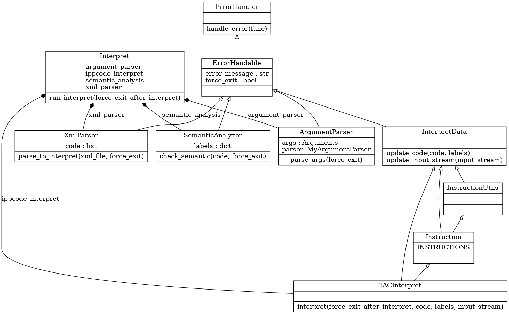

Implementační dokumentace k 2. úloze do IPP 2022/2023

Jméno a příjmení: Štěpán Vondráček

Login: xvondr27

## UML diagram tříd

Jsou zde zobrazeny pouze metody a attributy, které nejsou privátní. 

## Třídy a návrh

Všechny tyto třídy jsou v balíčku IPPcode23Interpret. interpret.py slouží jako spouštěč interpretru.

### ErrorHandler

ErrorHandler má pouze jednu metodu a to `handle_error()`, která je statická. Instance této třídy se nevytváří. `handle_error()` se používá jako dekorátor všech funkcí, který potřebuji, aby po chybě ukončili program s příslušnou návratovou hodnotou. `handle_error()` se může použít na všechny třídy, které dědí třídu `ErrorHandable`. Všechny metody, které používájí tento dekorátor navracejí celočíselnou hodnotu a nastavují atribut `error_message`, který je zděděný ze třídy `ErrorHandable`, podle toho, jestli nastala chyba nebo ne.

`handle_error()` rozhoduje o chybě metody, která je dekorována touto metodou, následovně: Pokud návratová hodnota metody je menší jak 0 nebo vyšší jak 49, tak vypíše na standardní chybový výstup atribut `error_message` objektu, který volal tuto metodu a ukončí program voláním `exit()` s návratovou hodnotou co navrátila volaná metoda. Pokud je návratová hodnota v rozmezí 0 až 49, tak se se podívá na atribut `error_message` a pokud je zde pouze prázdný řetězec tak podle atributu `force_exit`, pokud je True ukončí program voláním `exit()`, pokud je False tak pokračuje ve vykonávání programu. Pokud není `error_message` prázdný řetězec tak vypíše `error_message` na standardní chybový výstup a ukončí program voláním `exit()`.

### ErrorHandable

Třída ErrorHandable obsahuje pouze atributy `error_message` a `force_exit`, které ostatní třídy dědí a používají se pro práci se dekorátorem `handle_error()`. Třídy, který tuto třídu dědí, mohou použít `handle_error()`.

### ArgumentParser

Tato třída má za úkol zjistit odkud se má vzít kód, který se má provést a odkud se má vzít vstup pro kód. Tato třída má pouze jednu metodu a to `parse_args()`. Tato metoda uloží cestu k soubor do `args.source_file` nebo `args.input_file`. Pokusí se ověřit pokud jsou tyto cesty platné a jestli jsou dostatečné práva pro čtení ze soboru. Pokud ne vrací návratový kód 11. Tato metoda je dekorována `handle_error()`, která se stará o ukončení programu v případě chyby. Také kontroluje zda je alespoň jeden z těchto argumentů zadán. Pokud ne vrací návratový kód 10. --help nebo -h vypíše nápovědu a ukončí program s návratovou hodnotou 0. pokud se jakkoliv kombinuje -h s nečím jiným vrací návratový kód 10. 

### XmlParser

Tato třída se používá, aby načetla soubor ve formátu xml a převedla ho do reprezentace kódu, kterou může použít interpret. Xml nemusí být zadáno v souboru lze ho přečíst i ze standardního vstupu podle hodnoty co uložil objekt třídy `ArgumentParser` do `args.source_file`. Kód je reprezentován v programu jako list instrukcí a instrukce je reprezentována jako list, kde na prvním indexu (nultém) je název instrukce (operační kód) a za ním následují argumenty instrukce (operačního kódu). Kód je uložen do atributu `code`. Toto provede metoda `parse_to_interpret()`. Tato metoda v případě chyby vždy vrací kód 32 nebo 31 pokud xml dokument nebyl "well-formed". Tato metoda je dokorována dekorátorem `handle_error()`, který se stará o ukončení programu v případě chyby.

V průběhu kontroly a převodu xml dokumentu na kód se kontroluje, jestli v dokumentu správná struktura. To znamená: první (root) element musí být `program` (na velikosti písmen záleží), ten musí obsahovat atribut `language` (na velikosti písmen záleží) s hodnotou `ippcode23` (na velikosti písmen nezáleží) a může obsahovat atribut `name` a `description` (na velikosti písmen záleží), žádné jiné nejsou povoleny. Dále se kontroluje, jestli na další úrovni elementů se nacházejí pouze elementy `instruction` (na velikosti písmen záleží), žádné jiné nejsou povoleny. Element `instruction` musí obsahovat atribut `order` (na velikosti písmen záleží) s celočíselnou hodnotou a atribut `opcode` (na velikosti písmen záleží) s hodnotou názvu instrukce (na velikosti písmen nezáleží). `order` musí být unikátní číslo pro každou instrukci.
Poté se kontroluje jestli se uvnitř elementu `instruction` nachází pouze elementy `argX` (na velikosti písmen záleží), kde X je číslo od 1 do 3. Žádné jiné Elementy se zde nacházet nesmějí. Elementy `argX` musí obsahovat atribut `type` (na velikosti písmen záleží) s hodnotou `var`, `label`, `type`, `nil`, `int`, `bool` nebo `string` (na velikosti písmen nezáleží). Uvnitř elementu `argX` se nachází hodnota argumentu. Po kontrole se začne vytvářet instrukce a vkládat do atributu `code`. Argumenty instrukce jsou ukládány jako (typ konstanty nebo rámec proměnné)@(hodnota konstanty nebo jméno proměnné). Escape sekvence v typu string se zde převádí zpět na reprezentaci jako ASCII znak. Na konci seřadí instrukce podle hodnoty atributu `order` a vrátí kód 0.

### SemanticAnalyzer

Do této třídy se předá kód z `XmlParser`. Tato třída se stará o kontrolu sémantických pravidel. Tato třída má atribut `labels` je slovníkem, který naplní jménem návěští a indexem v kódu, kde se návěští nachází. Sémantické kontroly, které se provádí jsou vyhodnocení, zda konstantní hodnoty argumentů předaných do instrukce lze typově použít v této instrukci. Když konstanta nevyhovuje typu, který instrukce může použít tak vrací chybu. Chyby jsou vraceny metodou `handle_error()`. Metoda, která spustí kontrolu je `check_semantic()`. Dále kontroluje, zda všechny návěští, které se v kódu použili jsou definovány. V případě jakékoliv chyby vrací příslušný návratový kód.

### Nil

Datový typ, který značí nil, protože v IPPcode23 lze použít nil a v Pythonu už používám None, abych zjistil nedefinovanou hodnotu.

### TacInterpret

Tato třída se stará o interpretaci kódu. Má metodu `interpret()`, která je dekorována `handle_error()`, která se stará o ukončení programu v případě chyby. Spouští kód podle aktuálního indexu v kódu. Po každé spuštěné instrukci se index, který je v atributu `_pc` (program counter), zvýší o jedna. Jediný, co dokáže změnit tento index jsou skokové instrukce. Interpretace končí buď, že index ukazuje mimo kód nebo byla zavolána instrukce EXIT. Nastavuje se zde i odkud se bude číst vstup.

Instrukce jsou spuštěny pomocí slovníku instrukcí, který je definován ve třídě `Instruction`, ze kterého dědí TacInterpret a je uložen v atributu `INSTRUCTION`. Tento slovník obsahuje jména všech instrukcí, který jsou definovány v IPPcode23 a jejich implementace jako metody ve stejné třídě. Tyto implementace ještě používají pomocné metody definovaný ve třídě `InstructionUtils`. Jsou zde metody pro získání hodnoty z proměnné, rozdělení formátu argumentu z (typ konstanty nebo rámec proměnné)@(hodnota konstanty nebo jméno proměnné) na jednotlivé proměnné, který budou obsahovat typ konstanty nebo rámec proměnné a hodnotu konstanty nebo jméno proměnné. Dále jsou zde metody pro výpočet aritmetických, logických a relačních operací a metody pro uložení hodnoty do proměnné. Když nastane nějaká chyba, tak se pomocí výjimek dostane zpět do metody `interpret()` a ta se ukončí se správným návratovým kódem a pomocí `handle_error()` se vypíše chybová hláška a ukončí se program.

Vytvořil jsem vlastní výjimky, které zapíšou do třídy, která je volá do atributu `error_message` a podle druhu výjimky drží hodnotu návratového kódu.

O dostání výjimky zpět do metody `interpret()` se stará dekorátor `_return_error_code_decorator`, který navrátí rovnou hodnotu návratového kódu, výjimky která nastala v dekorované metodě a `_raise_again_err_decorator`, který vznese znovu výjimku, která nastala v dekorované metodě, aby se dostala až do metody `interpret()`. Oba dekorátory jsou definovány v třídě `InstructionUtils`.

Všechny data, nad kterýma pracují interpret a jeho části jsou v atributech ve třídě `InterpretData`. Jsou zde metody na resetování interpretru a aktualizace kódu a odkud se bude číst vstup. Atributy, které jsou zde: 

Atribut `code`, kde je uložen kód, který se bude spouštět.

Atribut `_labels`, který je funguje stejně jako v `SemanticAnalyzer`.

Atribut `_pc` index aktuální instrukce, která se má provést.

Atribut `_call_stack` kam se ukládá index kam se má program vrátit (je implementován jako list a slouží jako zásobník).

Atribut `_data_stack`, který slouží k ukládání hodnot po zavolání příslušné instrukce (stejně jako _call_stack).

Atribut `FRAMES` slouží jako slovník rámců, kde `GF`(global frame) je ukládána jako slovník kde se uloží název proměnné a její hodnota, `LF` (local frame), který je uložen jako list slovníku a tento list se chová jako zásobník, a `TF` (temporary frame), který je stejný jako `GF`, akorát může být i nedefinovaný takže None. 

Atribut `TYPES` slouží jako slovník, kde jsou uloženy metody pro konverzi hodnoty na daný typ.

Atribut `_input_stream` soubor, ze kterého se bude číst vstup nebo stdin.

Atribut `_instruction_counter` je počítadlo instrukcí, které se provedly.

Zjištění nedefinované nebo neinicializované proměnné se provádí za běhu. 

Každá zavolaná instrukce vrací návratový kód.

tímto řádkem se provede aktuální instrukce:

`err_code = self.INSTRUCTIONS[self.code[self._pc][0]](self)`

### Interpret

Slouží pro vytvoření objektů třídy ArgumentParser, XMLParser, SemanticAnalyzer a TacInterpret a spuštění ve správném pořadí. K tomu slouží metoda `run_interpret()`. 